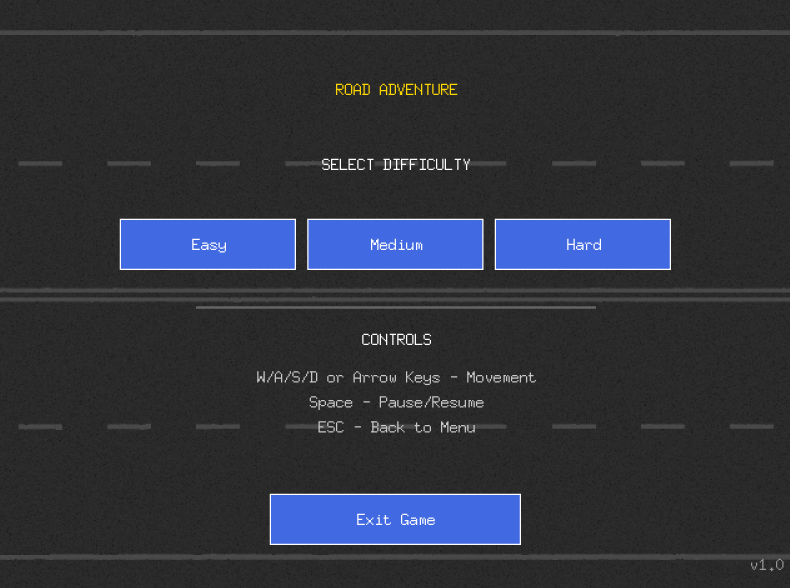
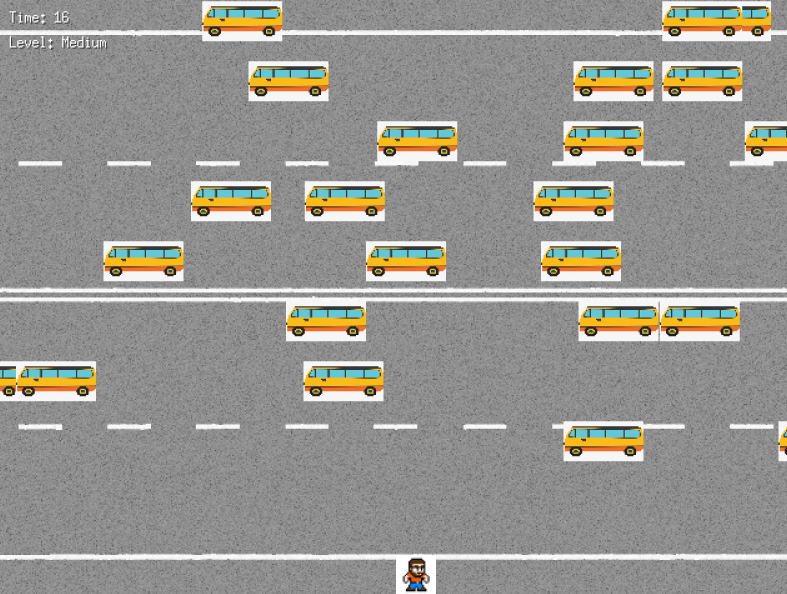
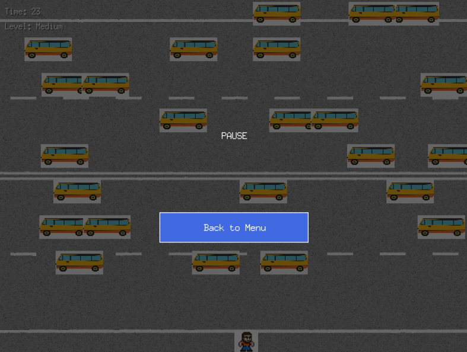

# 🚗 Road Adventure

Простая, но увлекательная игра, где вам предстоит провести своего персонажа через оживлённую дорогу, избегая столкновений с машинами. Игра написана на Go с использованием библиотеки Ebiten.

## 🎮 Особенности

- **Три уровня сложности**: Easy, Medium и Hard
- **Управление с клавиатуры**: интуитивное перемещение персонажа
- **Система времени**: ограниченное время для прохождения уровня
- **Красивый интерфейс**: удобное меню с кнопками
- **Пауза**: возможность приостановить игру в любой момент

## 📸 Скриншоты

| Главное меню             | Игровой процесс         | Меню паузы                |
| ------------------------ | ----------------------- | ------------------------- |
|  |  |  |

## 🕹️ Управление

- **W/↑, A/←, S/↓, D/→** - движение персонажа
- **Пробел** - пауза/продолжение игры
- **ESC** - возврат в главное меню
- **Мышь** - взаимодействие с меню и кнопками

## 🚀 Установка и запуск

1. Убедитесь, что у вас установлен Go (версия 1.16 или выше)
2. Клонируйте репозиторий:

```bash
git clone https://github.com/Kirutka/Run-Boy-Run
cd Run-Boy-Run
```

3. Установите зависимости:

```bash
go mod init Run-Boy-Run
go mod tidy
```

4. Запустите игру:

```bash
cd cmd
go run main.go
```

## 📦 Сборка

Для сборки исполняемого файла:

```bash
go build -o Run-Boy-Run main.go
```

## 🛠️ Технические детали

- Размер экрана: 640×480 пикселей
- Размер сетки: 32×32 пикселя
- Время на уровень: 30s (Easy), 25s (Medium), 10s (Hard)
- Реализовано на чистом Go с графической библиотекой Ebiten

## 📄 Лицензия

Этот проект распространяется под лицензией MIT. Подробнее см. в файле LICENSE.
